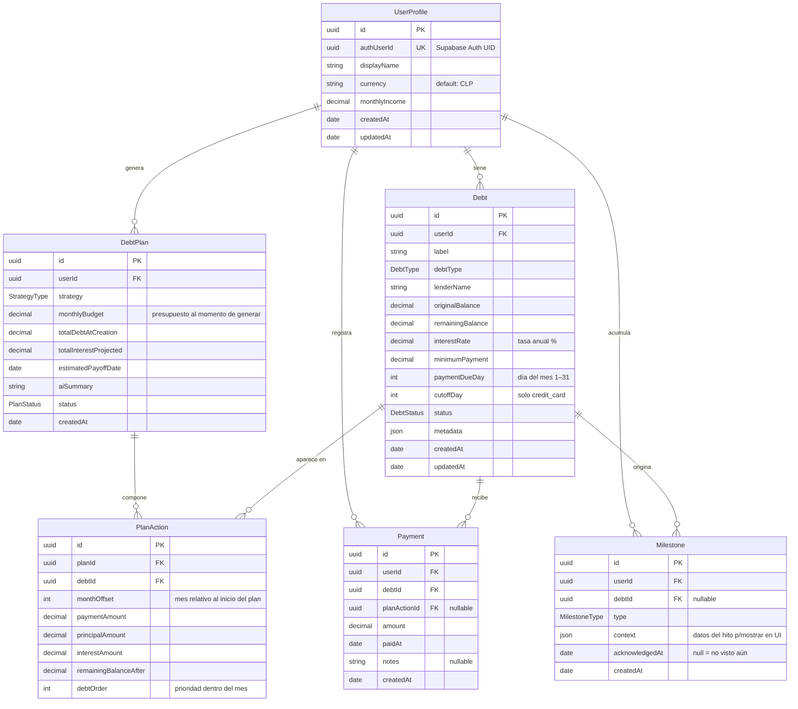

# Domain Model — Deudometro

**Versión:** 0.1.0
**Fecha:** 2026-03-23
**Estado:** Draft

---

## 1. Diagrama ERD

---

## 2. Entidades

### `UserProfile`

Perfil financiero del usuario. Extiende la identidad de Supabase Auth — un `UserProfile` se crea automáticamente al registrarse.

| Campo          | Tipo          | Restricciones                        | Descripción                                      |
|----------------|---------------|--------------------------------------|--------------------------------------------------|
| `id`           | `uuid`        | PK, auto-generado                    |                                                  |
| `authUserId`   | `uuid`        | UK, NOT NULL                         | UID de Supabase Auth — clave de relación         |
| `displayName`  | `string`      | max 100 chars                        | Nombre del usuario en la app                     |
| `currency`     | `string(3)`   | default `'CLP'`, ISO 4217            | Moneda principal del usuario                     |
| `monthlyIncome`| `decimal(15,2)`| NOT NULL, > 0                       | Ingreso mensual declarado                        |
| `createdAt`    | `timestamp`   | auto                                 |                                                  |
| `updatedAt`    | `timestamp`   | auto                                 |                                                  |

> `availableBudget` (presupuesto disponible para deudas) **no se persiste**. Se calcula en tiempo de ejecución como `monthlyIncome - gastos_fijos_declarados` cuando aplique, o es ingresado explícitamente por el usuario al generar un plan.

---

### `Debt`

Una deuda individual del usuario. Es la entidad central del sistema.

| Campo              | Tipo            | Restricciones                        | Descripción                                           |
|--------------------|-----------------|--------------------------------------|-------------------------------------------------------|
| `id`               | `uuid`          | PK                                   |                                                       |
| `userId`           | `uuid`          | FK → UserProfile, NOT NULL           |                                                       |
| `label`            | `string`        | NOT NULL, 1–60 chars                 | Nombre descriptivo (ej: "Tarjeta Visa BCI")           |
| `debtType`         | `DebtType`      | NOT NULL                             | Ver enum abajo                                        |
| `lenderName`       | `string`        | max 100 chars, nullable              | Banco, fintech o persona acreedora                    |
| `originalBalance`  | `decimal(15,2)` | NOT NULL, > 0                        | Saldo en el momento de registro                       |
| `remainingBalance` | `decimal(15,2)` | NOT NULL, > 0                        | Saldo actual pendiente                                |
| `interestRate`     | `decimal(7,4)`  | nullable, 0–999.9999                 | Tasa de interés anual en %. Nullable para `informal_lender` sin interés |
| `minimumPayment`   | `decimal(15,2)` | NOT NULL, ≥ 0                        | Pago mínimo mensual                                   |
| `paymentDueDay`    | `int`           | NOT NULL, 1–31                       | Día del mes en que vence el pago                      |
| `cutoffDay`        | `int`           | nullable, 1–31                       | Día de corte. Solo relevante para `credit_card`       |
| `status`           | `DebtStatus`    | NOT NULL, default `active`           | Ver enum abajo                                        |
| `metadata`         | `json`          | nullable                             | Atributos específicos por tipo. Ver sección 3         |
| `createdAt`        | `timestamp`     | auto                                 |                                                       |
| `updatedAt`        | `timestamp`     | auto                                 |                                                       |

---

### `DebtPlan`

Un plan de pagos generado para el usuario en un momento dado. Un usuario puede tener múltiples planes; solo uno puede estar `active` a la vez.

| Campo                    | Tipo            | Restricciones                      | Descripción                                                  |
|--------------------------|-----------------|------------------------------------|--------------------------------------------------------------|
| `id`                     | `uuid`          | PK                                 |                                                              |
| `userId`                 | `uuid`          | FK → UserProfile, NOT NULL         |                                                              |
| `strategy`               | `StrategyType`  | NOT NULL                           | Ver enum abajo                                               |
| `monthlyBudget`          | `decimal(15,2)` | NOT NULL, > 0                      | Presupuesto mensual que el usuario comprometió para el plan  |
| `totalDebtAtCreation`    | `decimal(15,2)` | NOT NULL                           | Snapshot del total adeudado al generar el plan               |
| `totalInterestProjected` | `decimal(15,2)` | NOT NULL                           | Total de intereses proyectados si se sigue el plan           |
| `estimatedPayoffDate`    | `date`          | NOT NULL                           | Fecha estimada de libertad financiera                        |
| `aiSummary`              | `text`          | nullable                           | Resumen generado por IA con consejos y observaciones         |
| `status`                 | `PlanStatus`    | NOT NULL, default `active`         | Ver enum abajo                                               |
| `createdAt`              | `timestamp`     | auto                               |                                                              |

---

### `PlanAction`

Cada acción de pago mensual dentro de un `DebtPlan`. Define exactamente cuánto pagar a qué deuda en qué mes.

| Campo                  | Tipo            | Restricciones             | Descripción                                                    |
|------------------------|-----------------|---------------------------|----------------------------------------------------------------|
| `id`                   | `uuid`          | PK                        |                                                                |
| `planId`               | `uuid`          | FK → DebtPlan, NOT NULL   |                                                                |
| `debtId`               | `uuid`          | FK → Debt, NOT NULL       |                                                                |
| `monthOffset`          | `int`           | NOT NULL, ≥ 1             | Mes relativo al inicio del plan (1 = primer mes, 2 = segundo…) |
| `paymentAmount`        | `decimal(15,2)` | NOT NULL, > 0             | Total a pagar ese mes a esta deuda                             |
| `principalAmount`      | `decimal(15,2)` | NOT NULL, ≥ 0             | Porción que amortiza capital                                   |
| `interestAmount`       | `decimal(15,2)` | NOT NULL, ≥ 0             | Porción que cubre intereses                                    |
| `remainingBalanceAfter`| `decimal(15,2)` | NOT NULL, ≥ 0             | Saldo proyectado después de este pago                          |
| `debtOrder`            | `int`           | NOT NULL, ≥ 1             | Orden de prioridad de esta deuda dentro del mes del plan       |

---

### `Payment`

Un pago real registrado por el usuario. Puede o no estar asociado a una `PlanAction`.

| Campo          | Tipo            | Restricciones                     | Descripción                                             |
|----------------|-----------------|-----------------------------------|---------------------------------------------------------|
| `id`           | `uuid`          | PK                                |                                                         |
| `userId`       | `uuid`          | FK → UserProfile, NOT NULL        |                                                         |
| `debtId`       | `uuid`          | FK → Debt, NOT NULL               |                                                         |
| `planActionId` | `uuid`          | FK → PlanAction, nullable         | Si el pago cumple una acción del plan activo            |
| `amount`       | `decimal(15,2)` | NOT NULL, > 0                     |                                                         |
| `paidAt`       | `date`          | NOT NULL                          | Fecha en que el usuario realizó el pago                 |
| `notes`        | `string`        | nullable, max 255                 | Observación libre del usuario                           |
| `createdAt`    | `timestamp`     | auto                              |                                                         |

---

### `Milestone`

Un hito alcanzado en el camino hacia la libertad financiera. Se genera automáticamente por el sistema.

| Campo            | Tipo            | Restricciones              | Descripción                                                     |
|------------------|-----------------|----------------------------|-----------------------------------------------------------------|
| `id`             | `uuid`          | PK                         |                                                                 |
| `userId`         | `uuid`          | FK → UserProfile, NOT NULL |                                                                 |
| `debtId`         | `uuid`          | FK → Debt, nullable        | Deuda específica que originó el hito (si aplica)                |
| `type`           | `MilestoneType` | NOT NULL                   | Ver enum abajo                                                  |
| `context`        | `json`          | NOT NULL                   | Datos para renderizar el hito en UI (ej: `{ amount: 50000, debtLabel: "Visa BCI" }`) |
| `acknowledgedAt` | `timestamp`     | nullable                   | `null` = hito pendiente de mostrar al usuario                   |
| `createdAt`      | `timestamp`     | auto                       |                                                                 |

---

## 3. Enums

### `DebtType`
| Valor             | Descripción                                      |
|-------------------|--------------------------------------------------|
| `credit_card`     | Tarjeta de crédito bancaria o fintech            |
| `personal_loan`   | Préstamo personal (banco, fintech, caja)         |
| `mortgage`        | Crédito hipotecario                              |
| `auto_loan`       | Crédito automotriz                               |
| `student_loan`    | Crédito educativo                                |
| `bnpl`            | Buy Now Pay Later (Klarna, Mercado Pago Cuotas…) |
| `informal_lender` | Deuda con persona natural (familiar, amigo)      |
| `other`           | Otro tipo no clasificado                         |

### `DebtStatus`
| Valor      | Descripción                                                     |
|------------|-----------------------------------------------------------------|
| `active`   | Deuda vigente con saldo pendiente                               |
| `paid_off` | Deuda saldada completamente                                     |
| `frozen`   | Deuda pausada temporalmente (refinanciación, disputa, etc.)     |

### `StrategyType`
| Valor       | Descripción                                                         |
|-------------|---------------------------------------------------------------------|
| `avalanche` | Pagar primero la deuda de mayor tasa de interés (mínimo interés total) |
| `snowball`  | Pagar primero la deuda de menor saldo (máxima motivación psicológica) |
| `hybrid`    | Combinar criterios: priorizar deudas críticas, luego avalanche      |

### `PlanStatus`
| Valor        | Descripción                                                     |
|--------------|-----------------------------------------------------------------|
| `active`     | Plan vigente que el usuario está siguiendo                      |
| `completed`  | Todas las deudas del plan fueron saldadas                       |
| `superseded` | Reemplazado por un nuevo plan generado posteriormente           |

### `MilestoneType`
| Valor                   | Descripción                                              |
|-------------------------|----------------------------------------------------------|
| `debt_paid_off`         | Una deuda fue saldada completamente                      |
| `halfway_point`         | Se pagó el 50% del total adeudado al inicio              |
| `first_payment`         | Primer pago registrado en el sistema                     |
| `plan_on_track`         | El usuario completó un mes siguiendo el plan al 100%     |
| `total_reduced_25pct`   | La deuda total se redujo un 25% desde el inicio          |
| `total_reduced_50pct`   | La deuda total se redujo un 50% desde el inicio          |
| `total_reduced_75pct`   | La deuda total se redujo un 75% desde el inicio          |

---

## 4. Estrategia de `metadata` JSON

El campo `metadata` en `Debt` almacena atributos que solo son relevantes para ciertos tipos de deuda. Esto evita columnas nulas en la tabla principal.

| `debtType`        | Estructura `metadata`                                                                 |
|-------------------|---------------------------------------------------------------------------------------|
| `credit_card`     | `{ creditLimit: number, lastFourDigits?: string }`                                   |
| `mortgage`        | `{ propertyValue?: number, remainingTermMonths: number }`                            |
| `auto_loan`       | `{ vehicleDescription?: string, remainingTermMonths: number }`                       |
| `student_loan`    | `{ institution?: string, remainingTermMonths: number }`                              |
| `bnpl`            | `{ merchant: string, installmentsTotal: number, installmentsPaid: number }`          |
| `informal_lender` | `{ hasInterest: boolean \| null, agreedTermDescription?: string }`                   |
| `personal_loan`   | `{ remainingTermMonths: number }`                                                    |
| `other`           | `{ description?: string }`                                                           |

---

## 5. Reglas de integridad del dominio

1. Un `UserProfile` tiene exactamente un `authUserId` — relación 1:1 con Supabase Auth.
2. `Debt.remainingBalance` nunca puede superar `Debt.originalBalance`.
3. `Debt.interestRate` es nullable solo cuando `debtType === 'informal_lender'`.
4. Solo un `DebtPlan` puede tener `status = 'active'` por usuario a la vez.
5. `PlanAction.principalAmount + PlanAction.interestAmount = PlanAction.paymentAmount`.
6. Un `Payment` no puede registrarse contra una `Debt` con `status = 'paid_off'`.
7. `Milestone.acknowledgedAt` solo puede pasar de `null` a un timestamp — nunca al revés.
8. `availableBudget` nunca se persiste; se pasa como input al generar un `DebtPlan`.

---

*Documento mantenido en: `docs/domain-model.md`*
