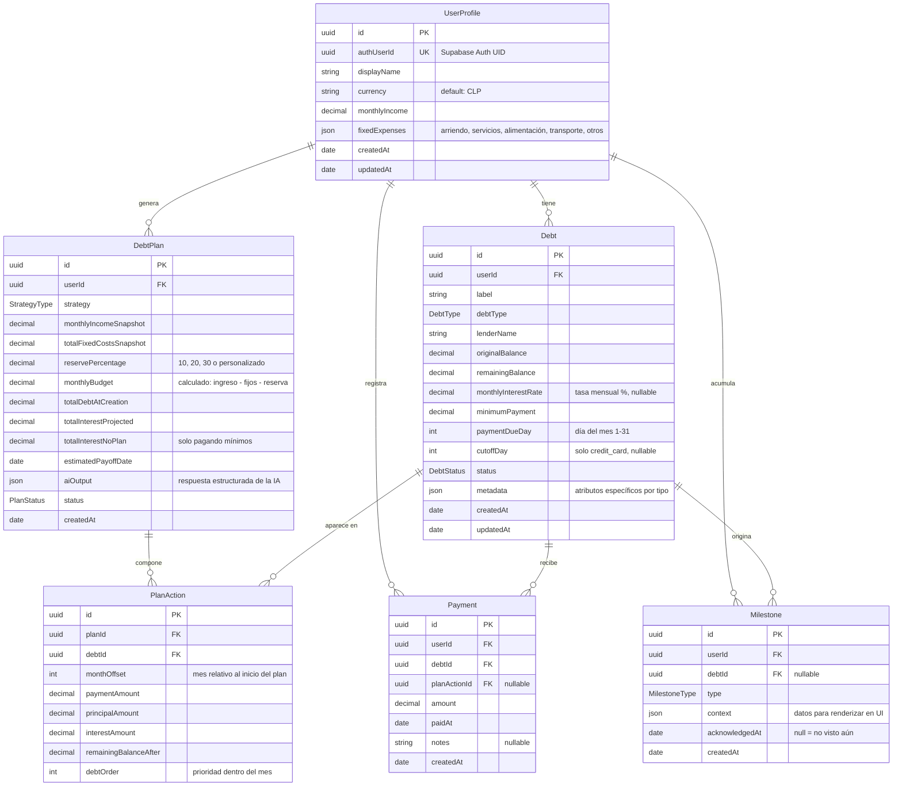

# Domain Model — Deudometro

**Versión:** 0.2.0
**Fecha:** 2026-03-23
**Estado:** Draft

**Changelog v0.2:** tasa de interés corregida a mensual; tipos de deuda reducidos a 4 según flujo; 2 estrategias nuevas (`crisis_first`, `guided_consolidation`); gastos fijos en `UserProfile`; `reservePercentage` en `DebtPlan`; `aiSummary` → `aiOutput json`; metadata de cada tipo enriquecida con campos reales de los formularios.

---

## 1. Diagrama ERD



---

## 2. Entidades

### `UserProfile`

Perfil financiero del usuario. Extiende la identidad de Supabase Auth — un `UserProfile` se crea automáticamente al registrarse.

| Campo            | Tipo             | Restricciones             | Descripción                                      |
|------------------|------------------|---------------------------|--------------------------------------------------|
| `id`             | `uuid`           | PK, auto-generado         |                                                  |
| `authUserId`     | `uuid`           | UK, NOT NULL              | UID de Supabase Auth — clave de relación         |
| `displayName`    | `string`         | max 100 chars             | Nombre del usuario en la app                     |
| `currency`       | `string(3)`      | default `'CLP'`, ISO 4217 | Moneda principal del usuario                     |
| `monthlyIncome`  | `decimal(15,2)`  | NOT NULL, > 0             | Ingreso líquido mensual declarado (Paso 2)       |
| `fixedExpenses`  | `json`           | NOT NULL                  | Gastos fijos mensuales capturados en Paso 3. Ver estructura abajo |
| `createdAt`      | `timestamp`      | auto                      |                                                  |
| `updatedAt`      | `timestamp`      | auto                      |                                                  |

**Estructura de `fixedExpenses`:**
```typescript
{
  rent:       number   // Arriendo / dividendo
  utilities:  number   // Servicios (agua, luz, gas)
  food:       number   // Alimentación
  transport:  number   // Transporte
  other:      number   // Otros fijos
  // total se calcula: nunca se persiste
}
```

> `availableBudget` (presupuesto para deudas) **nunca se persiste como campo**. Se calcula en tiempo de ejecución: `(monthlyIncome − Σ fixedExpenses) × (1 − reservePercentage/100)`. El resultado queda registrado en `DebtPlan.monthlyBudget` al generar el plan.

---

### `Debt`

Una deuda individual del usuario. Es la entidad central del sistema.

| Campo                 | Tipo            | Restricciones                | Descripción                                               |
|-----------------------|-----------------|------------------------------|-----------------------------------------------------------|
| `id`                  | `uuid`          | PK                           |                                                           |
| `userId`              | `uuid`          | FK → UserProfile, NOT NULL   |                                                           |
| `label`               | `string`        | NOT NULL, 1–60 chars         | Nombre descriptivo (ej: "Tarjeta Visa BCI")               |
| `debtType`            | `DebtType`      | NOT NULL                     | Ver enum — solo 4 tipos                                   |
| `lenderName`          | `string`        | max 100 chars, nullable      | Banco, fintech o persona acreedora                        |
| `originalBalance`     | `decimal(15,2)` | NOT NULL, > 0                | Saldo al momento del registro. Inmutable.                 |
| `remainingBalance`    | `decimal(15,2)` | NOT NULL, > 0                | Saldo actual pendiente. Mutable.                          |
| `monthlyInterestRate` | `decimal(7,4)`  | nullable, 0–99.9999          | **Tasa de interés mensual en %**. Nullable solo para `informal_lender` sin interés |
| `minimumPayment`      | `decimal(15,2)` | NOT NULL, ≥ 0                | Pago mínimo mensual comprometido                          |
| `paymentDueDay`       | `int`           | NOT NULL, 1–31               | Día del mes en que vence el pago                          |
| `cutoffDay`           | `int`           | nullable, 1–31               | Día de corte. Solo para `credit_card`                     |
| `status`              | `DebtStatus`    | NOT NULL, default `active`   | Ver enum                                                  |
| `metadata`            | `json`          | NOT NULL                     | Atributos específicos por tipo. Ver sección 4             |
| `createdAt`           | `timestamp`     | auto                         |                                                           |
| `updatedAt`           | `timestamp`     | auto                         |                                                           |

---

### `DebtPlan`

Un plan de pagos generado para el usuario en un momento dado. Almacena el snapshot financiero completo del momento de generación y el output estructurado de la IA.

| Campo                     | Tipo            | Restricciones                 | Descripción                                                       |
|---------------------------|-----------------|-------------------------------|-------------------------------------------------------------------|
| `id`                      | `uuid`          | PK                            |                                                                   |
| `userId`                  | `uuid`          | FK → UserProfile, NOT NULL    |                                                                   |
| `strategy`                | `StrategyType`  | NOT NULL                      | Estrategia seleccionada en Paso 5                                 |
| `monthlyIncomeSnapshot`   | `decimal(15,2)` | NOT NULL                      | Ingreso mensual al momento de generar el plan                     |
| `totalFixedCostsSnapshot` | `decimal(15,2)` | NOT NULL                      | Suma de gastos fijos al momento de generar el plan                |
| `reservePercentage`       | `decimal(5,2)`  | NOT NULL, 0–100               | % de reserva elegido en Paso 4 (10, 20, 30 o personalizado)      |
| `monthlyBudget`           | `decimal(15,2)` | NOT NULL, > 0                 | Presupuesto calculado disponible para deudas                      |
| `totalDebtAtCreation`     | `decimal(15,2)` | NOT NULL                      | Snapshot del total adeudado al generar el plan                    |
| `totalInterestProjected`  | `decimal(15,2)` | NOT NULL                      | Total de intereses pagando con este plan                          |
| `totalInterestNoPlan`     | `decimal(15,2)` | NOT NULL                      | Total de intereses pagando solo los mínimos (base de comparación) |
| `estimatedPayoffDate`     | `date`          | NOT NULL                      | Fecha estimada de libertad financiera                             |
| `aiOutput`                | `json`          | nullable                      | Respuesta estructurada de la IA. Ver estructura abajo             |
| `status`                  | `PlanStatus`    | NOT NULL, default `active`    | Ver enum                                                          |
| `createdAt`               | `timestamp`     | auto                          |                                                                   |

**Estructura de `aiOutput`:**
```typescript
{
  summary:            string   // Diagnóstico honesto, 1–3 oraciones
  strategy_rationale: string   // Por qué esta estrategia, 1–3 oraciones
  monthly_focus:      string   // Qué hacer este mes, 1 oración
  key_milestones: [
    { month: number, event: string, message: string }
  ]
  critical_alerts:    string[] // Alertas si hay deudas críticas, puede ser []
  free_date_message:  string   // Fecha de libertad financiera en lenguaje natural
}
```

---

### `PlanAction`

Cada acción de pago mensual dentro de un `DebtPlan`. Define cuánto pagar a qué deuda en qué mes.

| Campo                   | Tipo            | Restricciones              | Descripción                                                      |
|-------------------------|-----------------|----------------------------|------------------------------------------------------------------|
| `id`                    | `uuid`          | PK                         |                                                                  |
| `planId`                | `uuid`          | FK → DebtPlan, NOT NULL    |                                                                  |
| `debtId`                | `uuid`          | FK → Debt, NOT NULL        |                                                                  |
| `monthOffset`           | `int`           | NOT NULL, ≥ 1              | Mes relativo al inicio del plan (1 = primer mes)                 |
| `paymentAmount`         | `decimal(15,2)` | NOT NULL, > 0              | Total a pagar ese mes a esta deuda                               |
| `principalAmount`       | `decimal(15,2)` | NOT NULL, ≥ 0              | Porción que amortiza capital                                     |
| `interestAmount`        | `decimal(15,2)` | NOT NULL, ≥ 0              | Porción que cubre intereses del mes                              |
| `remainingBalanceAfter` | `decimal(15,2)` | NOT NULL, ≥ 0              | Saldo proyectado después de este pago                            |
| `debtOrder`             | `int`           | NOT NULL, ≥ 1              | Prioridad de esta deuda dentro del mes del plan                  |

---

### `Payment`

Un pago real registrado por el usuario. Puede o no estar asociado a una `PlanAction` del plan activo.

| Campo          | Tipo            | Restricciones                      | Descripción                                   |
|----------------|-----------------|-------------------------------------|-----------------------------------------------|
| `id`           | `uuid`          | PK                                  |                                               |
| `userId`       | `uuid`          | FK → UserProfile, NOT NULL          |                                               |
| `debtId`       | `uuid`          | FK → Debt, NOT NULL                 |                                               |
| `planActionId` | `uuid`          | FK → PlanAction, nullable           | Si el pago cumple una acción del plan activo  |
| `amount`       | `decimal(15,2)` | NOT NULL, > 0                       |                                               |
| `paidAt`       | `date`          | NOT NULL                            | Fecha en que el usuario realizó el pago       |
| `notes`        | `string`        | nullable, max 255                   | Observación libre del usuario                 |
| `createdAt`    | `timestamp`     | auto                                |                                               |

---

### `Milestone`

Un hito alcanzado en el camino hacia la libertad financiera. Generado automáticamente por el sistema.

| Campo            | Tipo            | Restricciones               | Descripción                                                     |
|------------------|-----------------|-----------------------------|-----------------------------------------------------------------|
| `id`             | `uuid`          | PK                          |                                                                 |
| `userId`         | `uuid`          | FK → UserProfile, NOT NULL  |                                                                 |
| `debtId`         | `uuid`          | FK → Debt, nullable         | Deuda que originó el hito (si aplica)                           |
| `type`           | `MilestoneType` | NOT NULL                    | Ver enum                                                        |
| `context`        | `json`          | NOT NULL                    | Datos para renderizar en UI (ej: `{ amount, debtLabel }`)       |
| `acknowledgedAt` | `timestamp`     | nullable                    | `null` = hito pendiente de mostrar al usuario                   |
| `createdAt`      | `timestamp`     | auto                        |                                                                 |

---

## 3. Enums

### `DebtType`

El flujo define exactamente 4 tipos de deuda. Cada tipo tiene su propio formulario con campos específicos.

| Valor             | Nombre en UI             | Descripción                                             |
|-------------------|--------------------------|---------------------------------------------------------|
| `credit_card`     | Tarjeta de Crédito       | Tarjeta bancaria o fintech con línea de crédito rotatoria |
| `consumer_loan`   | Crédito de Consumo       | Préstamo a plazo fijo (banco, fintech, caja, retail)    |
| `mortgage`        | Crédito Hipotecario      | Crédito para vivienda con garantía hipotecaria          |
| `informal_lender` | Deuda Informal           | Deuda con persona natural (familiar, amigo, empleador)  |

---

### `DebtStatus`

| Valor      | Descripción                                                 |
|------------|-------------------------------------------------------------|
| `active`   | Deuda vigente con saldo pendiente                           |
| `paid_off` | Deuda saldada completamente                                 |
| `frozen`   | Pausada temporalmente (refinanciación, disputa, etc.)       |

---

### `StrategyType`

El flujo define 5 estrategias. La estrategia presentada al usuario depende de si hay deudas críticas (Paso 5).

| Valor                  | Nombre en UI                        | Cuándo se presenta                        |
|------------------------|-------------------------------------|-------------------------------------------|
| `avalanche`            | Estrategia 1 — Avalancha            | Sin deudas críticas, sin personalizar     |
| `snowball`             | Estrategia 2 — Bola de nieve        | Sin deudas críticas, sin personalizar     |
| `hybrid`               | Estrategia 3 — Híbrida (el balance) | Sin deudas críticas, con personalización  |
| `crisis_first`         | Estrategia 4 — Primero el fuego     | Cuando hay deudas críticas detectadas     |
| `guided_consolidation` | Estrategia 5 — Consolidación guiada | Sin deudas críticas, sin personalizar     |

---

### `PlanStatus`

| Valor        | Descripción                                                 |
|--------------|-------------------------------------------------------------|
| `active`     | Plan vigente que el usuario está siguiendo                  |
| `completed`  | Todas las deudas del plan fueron saldadas                   |
| `superseded` | Reemplazado por un nuevo plan generado posteriormente       |

---

### `MilestoneType`

| Valor                 | Descripción                                                |
|-----------------------|------------------------------------------------------------|
| `debt_paid_off`       | Una deuda fue saldada completamente                        |
| `first_payment`       | Primer pago registrado en el sistema (global)              |
| `plan_on_track`       | El usuario completó un mes siguiendo el plan al 100%       |
| `total_reduced_25pct` | La deuda total se redujo un 25% desde el registro inicial  |
| `total_reduced_50pct` | La deuda total se redujo un 50% desde el registro inicial  |
| `total_reduced_75pct` | La deuda total se redujo un 75% desde el registro inicial  |

---

## 4. Estrategia de `metadata` JSON

El campo `metadata` en `Debt` almacena atributos específicos del tipo de deuda, derivados de los formularios del Paso 1.

### `credit_card`
```typescript
{
  creditLimit:      number           // Límite total de la tarjeta
  isActivelyUsed:   boolean          // ¿Está usando activamente la tarjeta?
  lastFourDigits?:  string           // Últimos 4 dígitos (opcional, UI)
}
```

### `consumer_loan`
```typescript
{
  totalInstallments:      number     // Cuotas totales del crédito
  remainingInstallments:  number     // Cuotas que faltan
  hasInsurance:           boolean    // ¿La cuota incluye seguro?
  insuranceMonthlyAmount?: number    // Monto mensual del seguro (si aplica)
  allowsEarlyPayment:     boolean    // ¿Permite prepago sin penalización?
  discountDay?:           number     // Día de descuento mensual (1–31)
}
```

### `mortgage`
```typescript
{
  remainingInstallments:   number    // Cuotas (dividendos) restantes
  isFixedRate:             boolean   // true = tasa fija, false = variable
  hasInsurance:            boolean   // ¿El dividendo incluye seguros?
  insuranceMonthlyAmount?: number    // Monto mensual de seguros incorporados
  isDFL2:                  boolean   // ¿Acogido al DFL2 (beneficio tributario Chile)?
}
```

### `informal_lender`
```typescript
{
  hasInterest:              boolean | null  // true = tiene interés, false = sin interés, null = no definido
  urgencyLevel:             'low' | 'medium' | 'high'  // ¿Qué tan urgente es para ti?
  agreedMonthlyPayment?:    number          // Monto acordado a pagar por mes
  agreedTermDescription?:   string          // Descripción del plazo acordado (ej: "6 meses")
}
```

---

## 5. Reglas de integridad del dominio

1. Un `UserProfile` tiene exactamente un `authUserId` — relación 1:1 con Supabase Auth.
2. `Debt.remainingBalance` nunca puede superar `Debt.originalBalance` (excepción: capitalización previa al registro, ver BR-24).
3. `Debt.monthlyInterestRate` es nullable **solo** cuando `debtType === 'informal_lender'`.
4. Solo un `DebtPlan` puede tener `status = 'active'` por usuario a la vez.
5. `PlanAction.principalAmount + PlanAction.interestAmount = PlanAction.paymentAmount` (tolerancia ±1 por redondeo).
6. Un `Payment` no puede registrarse contra una `Debt` con `status = 'paid_off'`.
7. `Milestone.acknowledgedAt` solo puede pasar de `null` a timestamp — nunca al revés.
8. `availableBudget` nunca se persiste como campo. Se calcula como `(monthlyIncome − Σ fixedExpenses) × (1 − reservePercentage / 100)` y se almacena el resultado en `DebtPlan.monthlyBudget`.

---

*Documento mantenido en: `docs/domain-model.md`*
